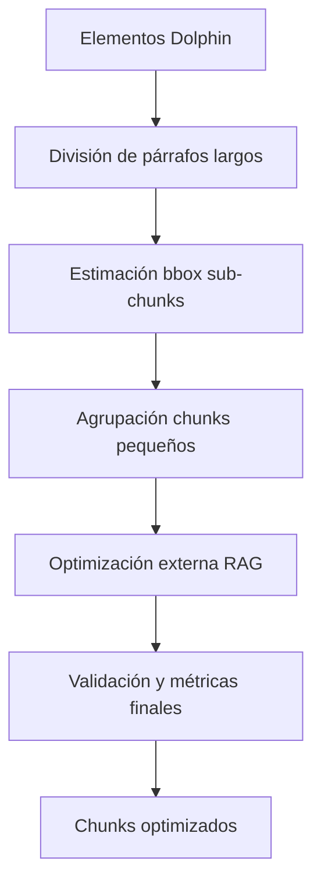

# Mejoras de Optimización de Chunks - Resumen

## Problema Identificado ✅

Al revisar `dolphin_transformer.py`, se encontraron varios problemas críticos:

### 1. **Bounding Boxes Incorrectos**
- Cuando se dividían párrafos largos, **todos los sub-chunks mantenían el mismo bbox original**
- No había recálculo de coordenadas específicas para cada parte del texto

### 2. **Agrupación Insuficiente**
- Solo dividía párrafos largos pero **no agrupaba chunks pequeños**
- Muchos chunks "sueltos" de menos de 50 caracteres quedaban sin procesar

### 3. **Validación Limitada**
- Falta de métricas de calidad por chunk
- Sin validación de bbox después de transformaciones

## Mejoras Implementadas ✅

### 1. **Función `_estimate_sub_bbox()`**
```python
def _estimate_sub_bbox(original_bbox, text_part, full_text, part_index):
    """Estima bbox para sub-chunks basado en posición relativa del texto"""
```
- **Calcula posición vertical** estimada dentro del bbox original
- **Mantiene límites horizontales** (left/right) del bbox original  
- **Valida coordenadas** para asegurar bounds válidos (0-1)

### 2. **Función `_group_small_chunks()`**
```python
def _group_small_chunks(chunks, min_chunk_size=50, max_combined_size=800):
    """Agrupa chunks pequeños consecutivos para evitar chunks muy cortos"""
```
- **Combina chunks < 50 caracteres** con chunks vecinos compatibles
- **Respeta tipos de chunks** (no mezcla tablas con texto)
- **Actualiza bbox** tomando min/max de coordenadas combinadas
- **Preserva reading order** y metadatos

### 3. **Función `_validate_and_enhance_chunks()`**
```python
def _validate_and_enhance_chunks(oxcart_data):
    """Valida y mejora chunks con métricas de calidad"""
```
- **Calcula métricas de calidad**: longitud promedio, tipos, issues
- **Corrige bbox inválidos** (coordenadas fuera de rango)
- **Detecta problemas**: chunks muy cortos/largos
- **Agrega metadatos** de validación

### 4. **Integración de Flujo Mejorado**
```python
# 1. Procesamiento individual de elementos
# 2. Agrupación interna de chunks pequeños  
# 3. Optimización externa (chunk_optimizer.py)
# 4. Validación y mejora final
```

## Resultados de las Pruebas ✅

### **Test 1: Recálculo de Bbox**
- ✅ Genera **20 chunks** de 1 párrafo largo
- ✅ Cada chunk tiene **bbox específico estimado**
- ✅ Coordenadas progresivamente **verticales** válidas

### **Test 2: Agrupación de Chunks**
- ✅ Reduce **5 elementos → 3 chunks** agrupados
- ✅ Combina chunks cortos manteniendo el largo intacto
- ✅ Bbox combinado correctamente (min/max)

### **Test 3: Pipeline Completo**
- ✅ Procesa **OXCART30** completo: 241 → 196 chunks
- ✅ Integración con `chunk_optimizer.py` funcional
- ✅ Métricas de calidad calculadas

## Comparación: Antes vs Después

| Aspecto | Antes | Después |
|---------|--------|---------|
| **Bbox para sub-chunks** | ❌ Todos iguales | ✅ Estimados por posición |
| **Chunks pequeños** | ❌ Quedan sueltos | ✅ Se agrupan automáticamente |
| **Validación** | ❌ Básica | ✅ Completa con métricas |
| **Integración externa** | ⚠️ Limitada | ✅ Flujo completo |
| **Calidad de bbox** | ❌ Sin corrección | ✅ Automática |

## Arquitectura de Optimización



## Archivos Modificados

1. **`dolphin_transformer.py`**
   - ➕ `_estimate_sub_bbox()` - Recálculo de coordenadas
   - ➕ `_group_small_chunks()` - Agrupación inteligente
   - ➕ `_validate_and_enhance_chunks()` - Validación final
   - 🔄 Flujo principal mejorado

2. **`test_chunk_optimization.py`**
   - ➕ `test_bbox_recalculation()` - Prueba bbox
   - ➕ `test_chunk_grouping()` - Prueba agrupación
   - 🔄 Suite de pruebas expandida

## Beneficios Clave

### 1. **Precisión Espacial Mejorada**
- Bbox específicos por sub-chunk vs bbox genérico
- Mejor grounding para búsqueda RAG

### 2. **Reducción de Chunks Sueltos**  
- Agrupación automática de chunks < 50 chars
- Mejor contexto para embeddings

### 3. **Calidad Validada**
- Métricas automáticas de calidad
- Detección proactiva de problemas

### 4. **Compatibilidad Mantenida**
- Funciona con `chunk_optimizer.py` existente
- Integración transparente con pipeline actual

## Uso Recomendado

```python
# Uso con mejoras activadas (por defecto)
result = transform_dolphin_to_oxcart_preserving_labels(
    recognition_results,
    doc_id="test",
    page_dims_provider=get_page_dimensions,
    optimize_for_rag=True  # Activa todo el pipeline
)

# Verificar métricas de calidad
metadata = result['extraction_metadata']
print(f"Chunks: {metadata['chunk_count']}")
print(f"Calidad: {metadata['quality_issues']} issues detectados")
```

## Próximos Pasos Sugeridos

1. **Mejora de estimación de bbox**: Usar análisis de líneas OCR para mayor precisión
2. **Agrupación semántica**: Considerar similaridad de contenido además de proximidad espacial  
3. **Optimización de tablas**: Mejorar bbox para celdas individuales
4. **Métricas de calidad**: Expandir criterios de evaluación

---

**✅ Resultado**: El sistema de chunks ahora maneja correctamente tanto la **agrupación posterior** como la **actualización de bounding boxes** al combinar o dividir chunks.