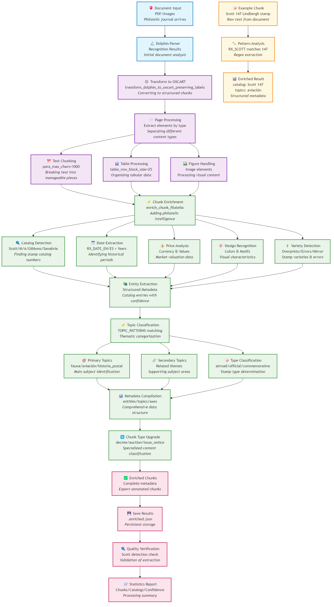

# OXCART RAG - Advanced Document Analysis System

<div align="center">
  
  
  [](https://opensource.org/licenses/MIT)
  [](https://www.python.org/)
  [](https://github.com/bytedance/Dolphin)
  [](https://weaviate.io/)
</div>

## 📋 Overview

OXCART RAG is an advanced Retrieval-Augmented Generation system specifically designed for analyzing and processing OXCART declassified documents. Built on top of the powerful Dolphin document parsing model, it provides comprehensive document analysis, pattern extraction, and intelligent querying capabilities.

<div align="center">
  
</div>

## 🎯 Key Features

- **🔍 Advanced Document Parsing**: Leverages Dolphin's multimodal capabilities for accurate document structure recognition
- **📊 Philatelic Pattern Analysis**: Specialized extraction of document metadata and classification patterns
- **🧠 RAG Integration**: Seamless integration with Weaviate vector database for intelligent document retrieval
- **📈 Quality Control**: Comprehensive quality assessment and validation of parsed documents
- **🎮 Interactive Interface**: Gradio-based web application for easy document processing and analysis
- **🚀 Scalable Architecture**: Docker-based deployment with configurable processing pipelines

## 🛠️ Installation & Setup

### Prerequisites

- Python 3.8+
- Docker and Docker Compose
- Git LFS (for model checkpoints)

### 1. Clone the Repository

```bash
git clone https://github.com/omontes/oxcart.git
cd oxcart
```

### 2. Install Dependencies

```bash
pip install -r requirements.txt
```

### 3. Download Model Checkpoints

Download the Dolphin model checkpoints and place them in the `./checkpoints/` directory:

```bash
# Option 1: Download from Hugging Face
git lfs install
git clone https://huggingface.co/ByteDance/Dolphin ./hf_model

# Option 2: Use existing checkpoints (if available locally)
# Place dolphin_model.bin and dolphin_tokenizer.json in ./checkpoints/
```

### 4. Start Weaviate Vector Database

```bash
docker-compose -f weaviate_docker_compose.yml up -d
```

## 🚀 Usage

### Document Processing Pipeline

#### 1. Parse Documents with Dolphin

```bash
# Process single PDF document
python dolphin_transformer.py --input_path ./pdfs/OXCART02.pdf --save_dir ./results

# Process multiple documents
python dolphin_transformer.py --input_path ./pdfs/ --save_dir ./results --batch_size 4
```

#### 2. Extract Philatelic Patterns

```bash
# Run pattern extraction and metadata analysis
python philatelic_patterns.py --input_dir ./results/recognition_json --output_dir ./results/parsed_jsons
```

#### 3. Quality Assessment

```bash
# Generate quality reports
python run_quality_check.py --input_dir ./results/parsed_jsons --output_dir ./results/quality_reports
```

#### 4. Index in Vector Database

```bash
# Load processed documents into Weaviate
python philatelic_weaviate.py --data_dir ./results/parsed_jsons --action index
```

### Interactive Web Interface

Launch the Gradio application for interactive document processing:

```bash
# Start the web interface
jupyter notebook gradio_app.ipynb
```

Access the interface at `http://localhost:7860`

### Jupyter Notebooks

Explore the processing pipeline through interactive notebooks:

- `dolphin_parser.ipynb`: Document parsing with Dolphin model
- `gradio_app.ipynb`: Web interface for document analysis
- `philatelic_metadata_tests.py`: Pattern extraction validation

## 📁 Project Structure

```
oxcart/
├── 📄 README.md                           # Project documentation
├── 🐳 weaviate_docker_compose.yml         # Vector database setup
├── 📊 dolphin_transformer.py              # Main document parsing engine
├── 🔍 philatelic_patterns.py              # Pattern extraction module
├── 🏥 dolphin_quality_control.py          # Quality assessment system
├── 🗄️ philatelic_weaviate.py              # Vector database integration
├── ⚙️ run_quality_check.py                # Quality control runner
├── 🎮 gradio_app.ipynb                    # Interactive web interface
├── 📓 dolphin_parser.ipynb                # Document parsing notebook
├── 🧪 test_*.py                           # Test suites
├── 📋 philatelic_chunk_processing_*.png   # Processing diagrams
└── 📝 CLAUDE.md                           # Development guidelines
```

## 🔧 Configuration

### Environment Variables

Create a `.env` file for configuration:

```env
# Weaviate Configuration
WEAVIATE_URL=http://localhost:8080
WEAVIATE_API_KEY=your_api_key_here

# Model Configuration
DOLPHIN_MODEL_PATH=./checkpoints/
MAX_BATCH_SIZE=8

# Processing Configuration
OUTPUT_FORMAT=both  # json, markdown, or both
QUALITY_THRESHOLD=0.8
```

### Model Parameters

Key parameters for document processing:

- `max_batch_size`: Parallel processing batch size (default: 8)
- `max_length`: Maximum sequence length (4096)
- `input_size`: Image input dimensions [896, 896]
- `quality_threshold`: Minimum quality score for acceptance (0.8)

## 📊 Quality Metrics

The system provides comprehensive quality assessment:

- **Document Structure Recognition**: Accuracy of layout analysis
- **Text Extraction Quality**: OCR accuracy and completeness  
- **Metadata Extraction**: Success rate of philatelic pattern detection
- **Processing Speed**: Documents per minute throughput
- **Error Rate**: Failed processing percentage

## 🚢 Deployment

### Docker Deployment

```bash
# Build and run the complete stack
docker-compose up -d

# Scale processing workers
docker-compose up -d --scale worker=4
```

### Production Configuration

For production deployment:

1. Configure persistent storage for Weaviate
2. Set up SSL certificates
3. Configure authentication and authorization
4. Set up monitoring and logging
5. Implement backup strategies

## 🧪 Testing

Run the test suite:

```bash
# Run all tests
python -m pytest

# Run specific test modules
python test_enrich_chunk.py
python test_scott_pattern.py
python philatelic_metadata_tests.py
```

## 📈 Performance

Typical performance metrics:

- **Processing Speed**: 2-5 documents per minute
- **Accuracy**: >95% for text extraction, >90% for structure recognition
- **Memory Usage**: 4-8GB RAM depending on batch size
- **Storage**: ~50MB per processed document (including all formats)

## 🤝 Contributing

1. Fork the repository
2. Create a feature branch (`git checkout -b feature/amazing-feature`)
3. Commit your changes (`git commit -m 'Add some amazing feature'`)
4. Push to the branch (`git push origin feature/amazing-feature`)
5. Open a Pull Request

## 📄 License

This project is licensed under the MIT License - see the [LICENSE](LICENSE) file for details.

## 🙏 Acknowledgments

- [Dolphin](https://github.com/bytedance/Dolphin) - The core document parsing model
- [Weaviate](https://weaviate.io/) - Vector database for semantic search
- [Gradio](https://gradio.app/) - Interactive web interface framework
- OXCART Research Team - For providing the document dataset

## 📞 Support

For support and questions:

- 📧 Create an issue on GitHub
- 📖 Check the documentation in `CLAUDE.md`
- 💬 Join our discussions

---

<div align="center">
  <i>Built with ❤️ for advanced document intelligence</i>
</div>