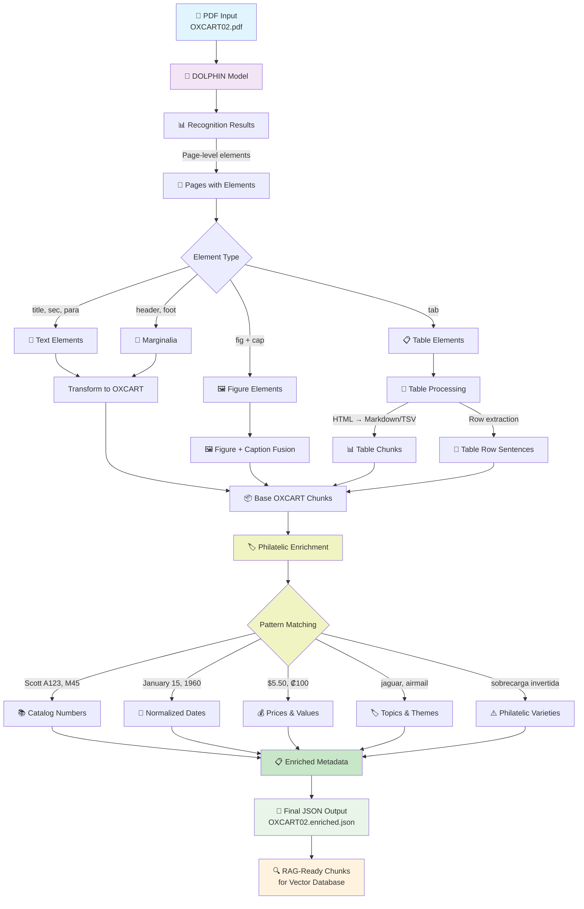
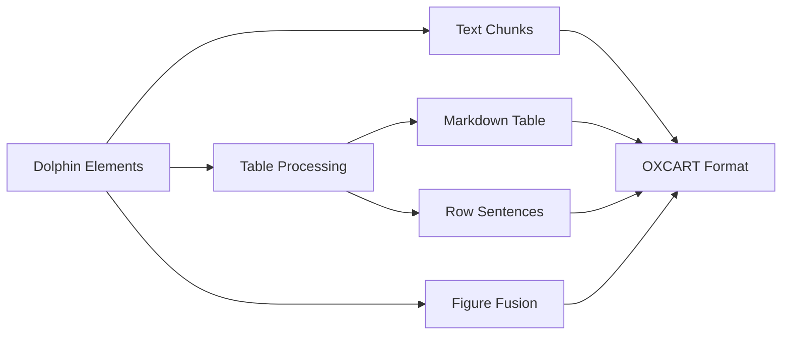
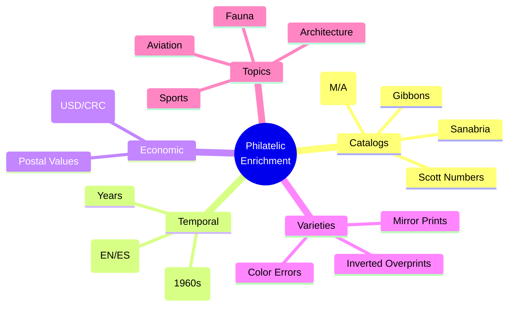

# Diagrama del Pipeline Dolphin Parser

## Detalles del Pipeline

### 1. **Entrada** 
- Archivo PDF (ej: `OXCART02.pdf`)

### 2. **Procesamiento Dolphin**
- Modelo multimodal que analiza layout y contenido
- Genera elementos estructurados con reading order

### 3. **Transformación OXCART**

### 4. **Enriquecimiento Filatélico**

### 5. **Salida para RAG**
- Chunks optimizados con metadatos ricos
- Diferentes tipos: `text`, `table`, `table_row`, `figure`
- Listos para indexación vectorial

## Tipos de Chunks Generados

| Tipo | Descripción | Ejemplo |
|------|-------------|---------|
| `text` | Párrafos y texto general | Descripciones, artículos |
| `table` | Tablas completas en markdown | Catálogos de sellos |
| `table_row` | Filas como oraciones | "Scott: 123, Year: 1960, Value: $0.05" |
| `figure` | Imágenes con captions | Sellos con descripciones |
| `decree` | Decretos legislativos | Autorizaciones oficiales |
| `auction_result` | Resultados de subastas | Precios realizados |